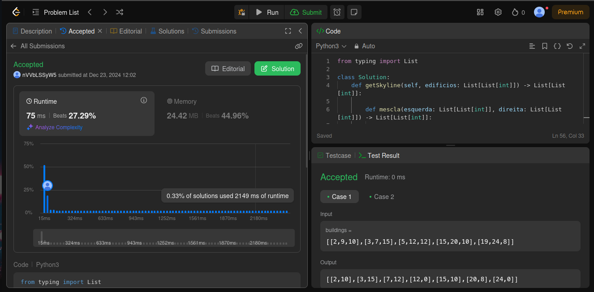
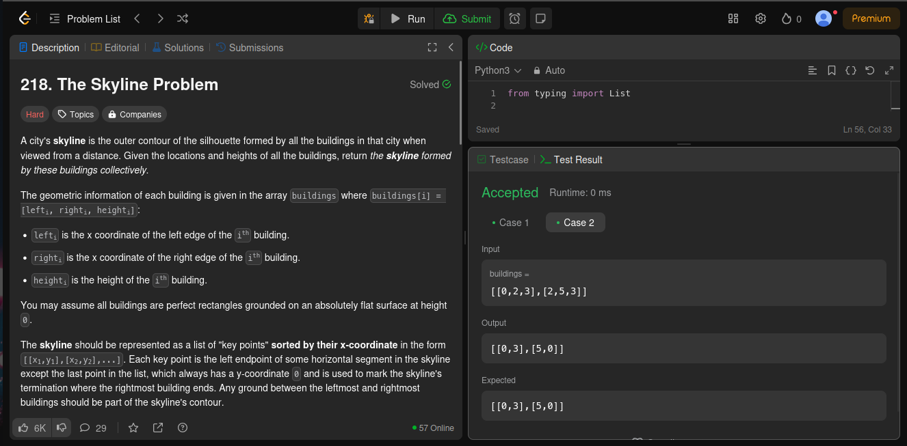
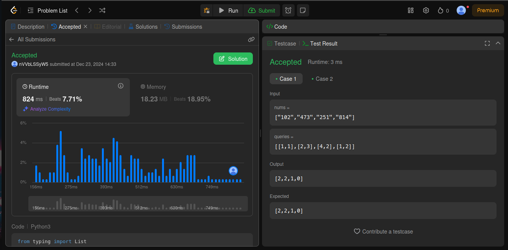
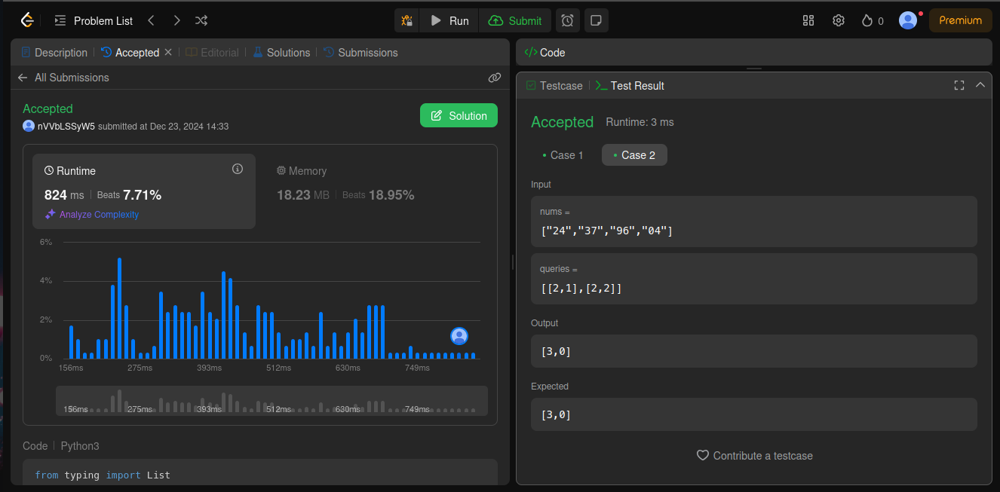
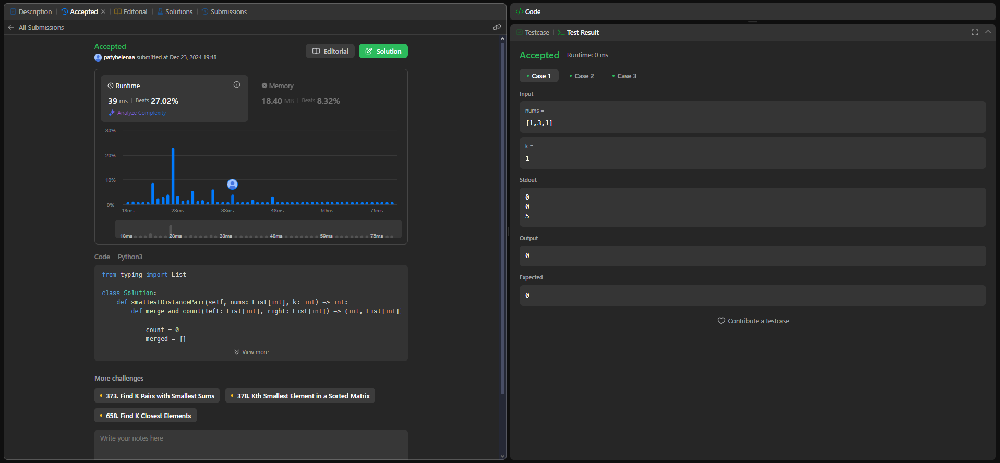
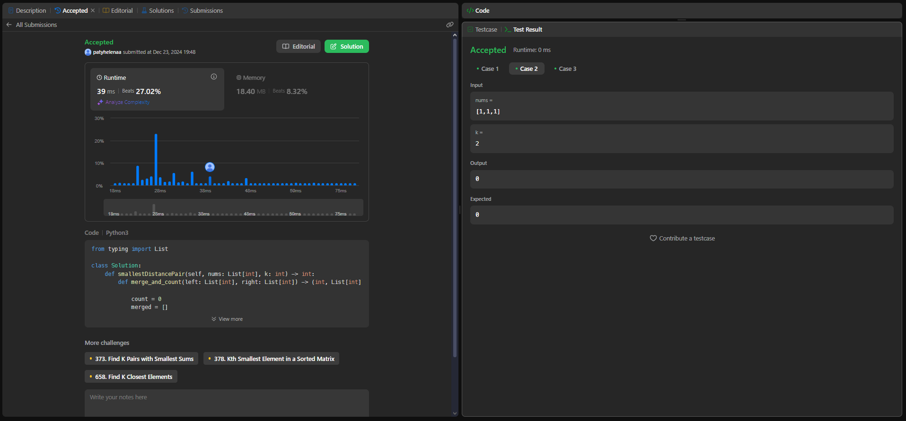
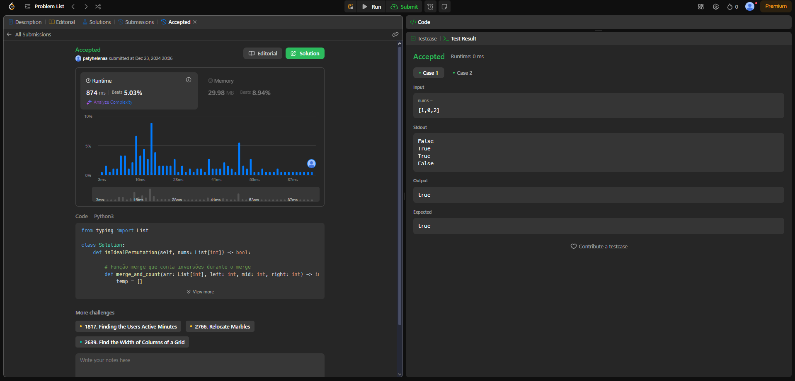
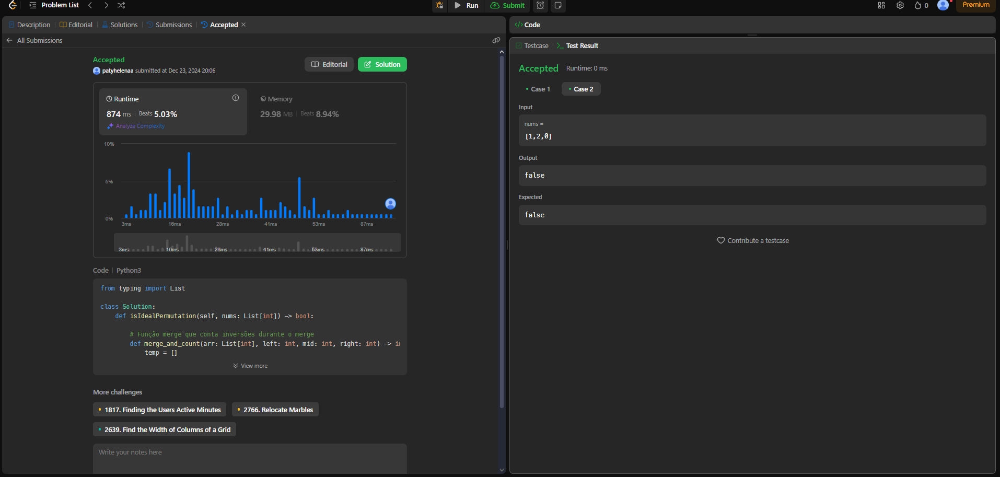

# DividirConquistar_quest_leetcode

**Número da Lista**: 52<br>
**Conteúdo da Disciplina**: D&C<br>

## Alunos
|Matrícula | Aluno |
| -- | -- |
| 22/1031265  |  Carlos Eduardo Rodrigues |
| 22/1037993 |  Patrícia Helena Macedo da Silva |

## Sobre
Este repositório contém soluções para problemas de programação resolvidos no LeetCode. Foram selecionadas 2 questões de dificuldade "Hard" e 2 de dificuldade "Medium". Cada solução é acompanhada pelo código correspondente.

Exercícios Abordados
| Código do Problema | Nome do Problema | Dificuldade |
| ------------------ | ---------------- | ----------- |
| 218 |[The Skyline Problem](https://leetcode.com/problems/the-skyline-problem/submissions/1486371503/) | Difícil |
| 2343  |[Query Kth Smallest Trimmed Number](https://leetcode.com/problems/query-kth-smallest-trimmed-number/description/) | Médio |
| 719 |[Find K-th Smallest Pair Distance](https://leetcode.com/problems/find-k-th-smallest-pair-distance/) | Difícil |
| 775 |[Global and Local Inversions](https://leetcode.com/problems/global-and-local-inversions/description/)  | Médio |

## Screenshots

### [218. The Skyline Problem](https://leetcode.com/problems/the-skyline-problem/submissions/1486371503/)



### [2343. Query Kth Smallest Trimmed Number](https://leetcode.com/problems/query-kth-smallest-trimmed-number/description/)



### [719. Find K-th Smallest Pair Distance](https://leetcode.com/problems/find-k-th-smallest-pair-distance/)



### [775. Global and Local Inversions](https://leetcode.com/problems/global-and-local-inversions/description/)




## Instalação 
**Linguagem**: Python<br>

1. Navegue até a pasta do problema desejado. Ex: `cd  218`
2. Rode o algoritmo com o comando:

```
python3 solucao.py
```

## Uso 
Basta executar o algoritmo.

## Outros 
Se preferir testar diretamente no LeetCode, basta copiar o código sem a main.

## Vídeo
[APRESENTAÇÃO 3](https://www.youtube.com/watch?v=hsge1wvB9wo)


